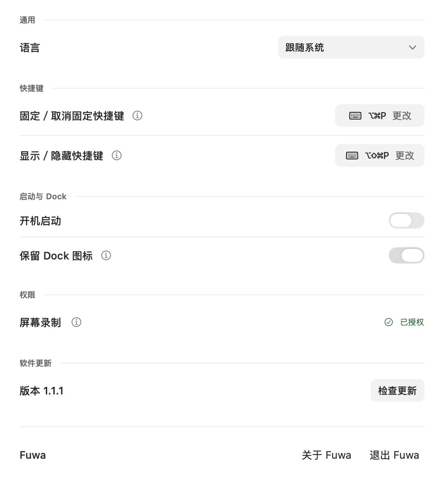
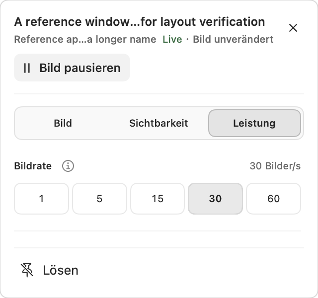

# Natural macOS interactions — 2026-10-10

This pass improves existing UI: readable help controls, settings groups, direct window options, content-sized panels and a clearer starting point. Input forwarding and virtual displays remain outside this pass.

## Verification

- Apple Silicon, macOS 27.0.1 (26A434), Swift 6.3.3.
- Strict native `swift test` passed with complete concurrency checking and warnings as errors: 69 declared tests in 15 suites, 66 active. The two explicit capture fixtures and virtual-display fixture stay disabled in this ordinary run.
- Release `FuwaLogicTests` passed with `-Osize`, complete concurrency checking and warnings as errors.
- The new native help test checks accessibility button role, label/help text, native tooltip registration, tracking-area configuration and hover/disabled state transitions.
- Existing presentation checks cover all seven languages, long source titles, large text, all three option sections and small available heights. The shorter performance section now fits below the picture section's height; neither is forced to fill 460 points.
- Seven-language offscreen rendering passed for settings, empty/populated lists, help, picture/visibility/performance options, paused/hidden/restoring states and narrow/large-text layouts.
- Universal Release preview passed arm64 and x86_64 strict builds, deep/strict signature verification and packaged Sparkle framework loading. The existing bundle ID and signing identity were retained; Intel was cross-compiled.
- `python3 scripts/test-macos-only.py`: six checks passed. `git diff --check`: passed.

## Running development app

After explicit restart approval, the new signed bundle was promoted to `dist/Fuwa.app` and launched by exact path. Its live process and signature were checked. The installed `/Applications/Fuwa.app` was not replaced, and no version, public release or recording permission was changed.

Native UI automation verified:

- Five settings headings: general, keyboard shortcuts, startup and Dock, permissions, updates.
- Clicking the Dock and screen-recording information buttons opens their explanations. Escape closes the explanation, retains the settings page and returns focus to the help button.
- The window picker opens with its search field focused; typed search finds an owned generated source window.
- Selecting that generated source produces a live pin. The management list exposes the redesigned picture controls, selected position, crop action and quality slider through accessibility.
- The disposable test pin was removed and its source application exited. Fuwa remains open on the new settings page.

## Preview images and limits

These are native offscreen renders with generated data, not photographs of user windows:

Hover feedback is checked through native control callbacks and tooltip registration; automation did not drive a physical pointer dwell. The floating help focus policy was reviewed in code; the repeatable live UI evidence above covers the settings window. No physical Intel, macOS 14, multi-display, VoiceOver or global-hotkey acceptance is claimed by this pass.
